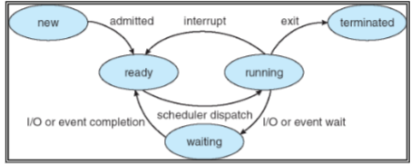

## Sistema operativo

#### Que es un proceso

Un proceso es una imagen o programa en ejecución.\
Tiene varias secciones
- Texto
- Program counter
- Sección de datos
- Stack del proceso
- El heap

El codigo esta en la sección de texto, luego el compilador hace asignaciones en la parte de data, para variables locales o globales, la memoria temporal que usa el codigo es el stack, que entran datos apilados y se va moviendo así la memoria, es dinámica, las variables automaticas (return, funciones, etc...) se guardan al stack. El puntero por ejemplo, va en el heap generalmente, también es memoria dinámica.

##### Seccuencia de ejecucion:
- Fetch a la memoria
- Decode
- Ejecucíon, con uso de registros
- Escritura de resultados en la memoria y en en los registros
- Repetir

##### Proces control Block

Cada proceso esta representado por un PCB, este contiene varios datos que describen el estado del proceso 

Cuando se dice que un procesador esta corriendo varios procesos a la vez es que el watchdog timer esta setiado cada muy bajos milisegundos y cambia de proceso, entonces da la ilusion que son varios procesos a la vez

Cola FIFO first in first out cola LIFO last in first out

----
resumen control
---
Un proceso es un programa en ejecución.\
CPU en ejecución, primero hace el fetch de la instrucción en la memória, decodifica, ejecuta usando los registros, escribe los resultados en los registros y repite.\
Estados de un proceso: 
- New: esta siendo creado.
- Ready: el proceso esta esperando la CPU.
- Running: se esta ejecutando las instrucciones.
- Waiting: Esperando que ocurra un evento.
- Terminated: termino la ejecución del proceso.

Proces control Block (PCB)

el pcb tiene varios datos que describen el estado del proceso.
- Estado del proceso.
- Program counter.
- Registers.
- Planificación.
- Administración de memoria.
- Contabilidad.

Cuando se habla que varios procesos estan corriendo a la misma vez es que pasa muy rapido y se ve como un efecto de que son varios al mismo tiempo.\
Los cambios se llaman cambio de contexto. Los PCB guardan la información de estado de los procesos, estos cambios se pueden gatillar por una interrupción, por ejemplo un timer.

El planificador de prcesos es aquel que designa los distintos programas o tareas al CPU para que las ejecute.\
Los procesos estan listos para ser ejecutados entran a una cola de procesos (ready queue).

Un proceso puede crear distintos procesos, aquellos que crean procesos se llaman *procesos padres* y el nuevo procesos se llama *proceso hijo*.\ hay dos opciones, el proceso padre sigue ejecutando con los hijos o el padre espera a que los hijos terminen.\
