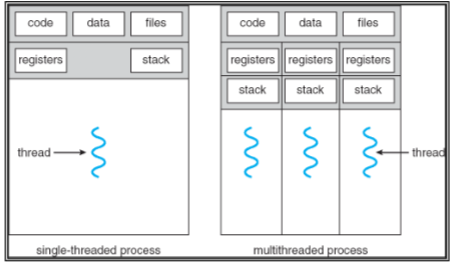

## Sistema operativo

#### Que es un proceso

Un proceso es una imagen o programa en ejecución.\
Tiene varias secciones
- Texto
- Program counter
- Sección de datos
- Stack del proceso
- El heap

El codigo esta en la sección de texto, luego el compilador hace asignaciones en la parte de data, para variables locales o globales, la memoria temporal que usa el codigo es el stack, que entran datos apilados y se va moviendo así la memoria, es dinámica, las variables automaticas (return, funciones, etc...) se guardan al stack. El puntero por ejemplo, va en el heap generalmente, también es memoria dinámica.

##### Seccuencia de ejecucion:
- Fetch a la memoria
- Decode
- Ejecucíon, con uso de registros
- Escritura de resultados en la memoria y en en los registros
- Repetir

##### Proces control Block

Cada proceso esta representado por un PCB, este contiene varios datos que describen el estado del proceso 

Cuando se dice que un procesador esta corriendo varios procesos a la vez es que el watchdog timer esta setiado cada muy bajos milisegundos y cambia de proceso, entonces da la ilusion que son varios procesos a la vez

Cola FIFO first in first out cola LIFO last in first out

----
resumen control
---
Un proceso es un programa en ejecución.\
CPU en ejecución, primero hace el fetch de la instrucción en la memória, decodifica, ejecuta usando los registros, escribe los resultados en los registros y repite.\
Estados de un proceso: 
- New: esta siendo creado.
- Ready: el proceso esta esperando la CPU.
- Running: se esta ejecutando las instrucciones.
- Waiting: Esperando que ocurra un evento.
- Terminated: termino la ejecución del proceso.


Proces control Block (PCB)

el pcb tiene varios datos que describen el estado del proceso.
- Estado del proceso.
- Program counter.
- Registers.
- Planificación.
- Administración de memoria.
- Contabilidad.

Cuando se habla que varios procesos estan corriendo a la misma vez es que pasa muy rapido y se ve como un efecto de que son varios al mismo tiempo.\
Los cambios se llaman cambio de contexto. Los PCB guardan la información de estado de los procesos, estos cambios se pueden gatillar por una interrupción, por ejemplo un timer.

El planificador de prcesos es aquel que designa los distintos programas o tareas al CPU para que las ejecute.\
Los procesos estan listos para ser ejecutados entran a una cola de procesos (ready queue).

Un proceso puede crear distintos procesos, aquellos que crean procesos se llaman *procesos padres* y el nuevo procesos se llama *proceso hijo*.\ hay dos opciones, el proceso padre sigue ejecutando con los hijos o el padre espera a que los hijos terminen.\
 
Threads son los procesos livianos, un proceso pesado es con un solo thread.\
Usar threads mejora el rendimiento del sistema con el usuario.

---
### Material estudio tarea 1

resumen OSTEP clase 2
----
El sistema operativo se encarga de que los procesos se ejecuten de manera eficiente, esto lo hace mediante un metodo que se llama virtualización, lo cual toma las partes físicas de un SO y las tranforma en algo más general para usar la forma virtual de si mismo, nos referimos a las maquinas virtuales.\
El SO tambien tiene APIs que podemos usar para llamar funciones, estas son la system calls.

Si tenemos el siguente codigo:

````c
#include <stdio.h>
#include <stdlib.h>
#include <sys/time.h>
#include <assert.h>
#include "common.h"

int main (int argc, char *argv[]){
    if (argc != 2){
        fprintf(stderr, "usage: cpu <string>\n");
        exit(1)
    }

    char *str = argv[1];
    while (1){
        Spin (1);
        printf("%s\n",str);
    }
    return 0;
}
````
#### CPU
Lo que podemos ver es que es un loop infinito que solo printea lo que le damos como argumento al principio, cada print se va a hacer despues de un segundo por la funcion Spin.\
Lo importante que tenemos que ver que pasa si le digo que corra el codigo de 4 maneras distntas,

Lo que se puede ver es que corre 4 al mismo tiempo, lo que hace esta ilusion posible es la maquina virtual al virtualizar la cpu tiene por decirlo infinitas CPU, transforma una grande en varias chicas y por eso podemos ver esto.

#### Memoria

````c
#include <unistd.h>
#include <stdio.h>
#include <stdlib.h>
#include "common.h"

int
main(int argc, char *argv[])
{
int *p = malloc(sizeof(int)); // a1
assert(p != NULL);
printf("(%d) address pointed to by p: %p\n",
getpid(), p); // a2
*p = 0; // a3
while (1) {
Spin(1);
*p = *p + 1;
printf("(%d) p: %d\n", getpid(), *p); // a4
}
return 0;
}
````
La memoria es un arreglo con direcciones que guardan datos y para escribir en la memoria se tiene que actualizar y escribir encima de estas direcciones que tiene.\ lo importante aca es que la MV virtualiza la memoria y cada prceso tiene su propio espacio de memoria privado, no comparten memoria.

Para crear threads la linea de codigo es Pthread_create(), podemos ver un thread como un funcion que corre en los mismos espacios de memoria que las otras funciones, cuando le damos instrucciones muy largas a los threads podemos ver que estas se confunden y pueden no tirar el valor deseado esta pasa cuando tenemos varias instrucciones separadas, como ir a buscar a la memoria, luego un proceso y luego guardarlo en la memoria, esto hace que se cree un problema de concurrencia al no ejecutarse atomicamente (todo de a una).

#### Procesos

Los procesos son aquellas instrucciones que ejecuta el sistema operativo. Las intrucciones que lee un proceso esta en la memoria, al igual de donde estan los datos, osea los procesos estan muy ligados a la memoria en varios aspectos.\
API:
- Create: Cualquier SO tiene que tener una forma de crear nuevos procesos, podemos ver un ejemplo cuando ecribimos un comando en la terminal si o si se esta creando un proceso nuevo en el PC.
- Destroy: Al igual que podemos crear nuevos procesos tambien hay que poder destruirlos de manera forzosa.
- Wait: Hay veces que es bueno esperar que un proceso termine de correr.
- Miscellanius Control: Hay veces que esperar o matar un proceso no es lo deseado, por eso hay otrocontroles que son posibles, por ejemplo suspender un proceso.
- Status: Es ver la información de estado de un proceso 

##### Create
Lo primero que tenemos que hacer para que el sistema operativo corra un programa es cargarlo y un dato estatico en la memoria, luego la memoria tiene que asignar espacio para el run-time stack o solamente stack, en C este espacio se ocupa para las variables, los parametros de una función y returns. También tiene que asignar memoria del heap, este espacio se ocupa para las cosas dinamicas como los malloc() y el free() 

##### State
- Running: significa que un proceso esta corriendo en el procesador
- Ready: Significa que esta listo para correr pero el SO ha decidido que todavia no es momento para que lo haga.
- Blocked: Significa que el proceso hizo alguna operacion que no va a correr hasta que pase algun evento que haga que restaure su running state denuevo.


##### Fork() System Call
Se usa para crear nuevos procesos, es un llamado muy extraño.

````c
#include <stdio.h>
#include <stdlib.h>
#include <unistd.h>
#include <sys/wait.h>

int main(int argc, char *argv[]) {
printf("hello world (pid:%d)\n", (int) getpid());
int rc = fork();
if (rc < 0) { // fork failed; exit
fprintf(stderr, "fork failed\n");
exit(1);
} else if (rc == 0) { // child (new process)
printf("hello, I am child (pid:%d)\n", (int) getpid());
} else { // parent goes down this path (main)
int rc_wait = wait(NULL);
printf("hello, I am parent of %d (rc_wait:%d) (pid:%d)\n",
rc, rc_wait, (int) getpid());
}
return 0;
}
````


Lo que podemos ver en primera instacia es primero que imprime un Hello World con el numero de PID que es el process idenifier, es como el rut del proceso. Luego llama a la funcion fork() que es una manera de hacer un proceso, lo que hace es llamar una copia casi exacta de la llamada que vendria siendo un proceso hijo, lo que se ve es que no corre dentro del main(). Es raro, el proceso hijo ahora tiene otro PI, osea que tiene su propio espacio en la memoria privado y es distinto que el proceso padre.

##### Wait() System Call
Hasta ahora pudimos crear un proceso hijo que hace un print y se va, es util a veces esperar a que un proceso hijo termine antes de que el padre empiece a correr, para eso usamos este System Call Wait().
````c
} else if (rc == 0) { // child (new process)
printf("hello, I am child (pid:%d)\n", (int) getpid());
} else { // parent goes down this path (main)
int rc_wait = wait(NULL); // aca esta el Wait()
printf("hello, I am parent of %d (rc_wait:%d) (pid:%d)\n",
rc, rc_wait, (int) getpid());
````
Como podemos ver en el fragmento modificado del codigo anterior aca hay un wait() hasta que el proceso hijo termine.


##### Exec() System Call
Se usa cuando quiero correr un programa que es diferente que el llamado, por ejemplo el fork()

````c
#include <stdio.h>
#include <stdlib.h>
#include <unistd.h>
#include <string.h>
#include <sys/wait.h>

int main(int argc, char *argv[]) {
printf("hello world (pid:%d)\n", (int) getpid());
int rc = fork();
if (rc < 0) { // fork failed; exit
fprintf(stderr, "fork failed\n");
exit(1);
} else if (rc == 0) { // child (new process)
printf("hello, I am child (pid:%d)\n", (int) getpid());
char *myargs[3];
myargs[0] = strdup("wc"); // program: "wc" (word count)
myargs[1] = strdup("p3.c"); // argument: file to count
myargs[2] = NULL; // marks end of array
execvp(myargs[0], myargs); // runs word count
printf("this shouldn’t print out");
} else { // parent goes down this path (main)
int rc_wait = wait(NULL);
printf("hello, I am parent of %d (rc_wait:%d) (pid:%d)\n",
rc, rc_wait, (int) getpid());
}
return 0;
}
````
Como se puede ver en el codigo en la parte donde sale myargv[*] y luego execvp(myargs[0], myargs), executa otro programa que cuenta la cantidad de palabras que hay en el archivo del cual se esta haciendo el System Call.\
Lo que hace es que se le da un nombre de un ejecutable ("wc") y unos argumentos ("p3.c"), luego carga el codigo y los datos estaticos del ejecutable y sobre escribe su propio segmento de codigo y se reinicia el heap con los datos dinamicos, no crea otro proceso solo que transforma el que ya se esta ejecutando en otro programa.

Resumen ppt 2
----

##### Multiplexación del CPU

Con la multiprogramación el SO mantiene varios procesos ejecutando a la vez en la memoria principal, pero solo un proceso esta corriendo en cada CPU. El cambio de contexto es cuando hay cambio de CPU entre procesos, estos cambio de contexto se gatillan por un evento, por ejemlo una interrupción.

##### Planificación de procesos

Uno de los objetivos de la multiprogramación es mantener ocupada la CPU eficientemente, el tiempo de la CPU es gastado por vários procesos a la vez.

###### Colas De Planificación
Cuando los procesos son creados entran en una cola esperando a ser ejecutados por la CPU, esta cola esta en la memoria y se llama *"ready queue"*. Cuando el proceso es elejido para ser ejecutado se despacha.\
El proceso migra de colas durante su tiempo, el SO debe elejir con ciertos criterios cual es el proceso que se va a ejecutar, la naturaleza de los planificadores esta en función del tiempo.
- Planificados de corto plazo (despachador): Este elije con mayor frecuencia los trabajos que se van a ejecutar, es muy rapido.
- Planificador de mediano plazo: Saca los procesos de la memoria y son movidos al disco, cuando el proceso es ejecutado nuevamente lo saca del disco y lo mueve nuevamente a la memoria (swapping).
- Planificador de largo plazo (job sheduler): Solo tiene sentido en procesamiento de batches, los procesos se mantienen en un pool en almacenamiento masivo, elije el proximo trabajo a cargar en la memoria.

##### Creación de procesos
El creador de procesos se llama proceso padre y el creado se llama proceso hijo, cada proceso hijo puede crear más procesos y aasí crear un árbol de procesos. Cada proceso tiene su identificador PID.\
Hay dos posibilidades cuando se crea un proceso, que el padre siga corriendo con los procesos hijos o que este los espere hasta que termine.\
Costo de crear un proceso:
- Es barato construir el PCB
- Es caro crear las tablas y direcciones del proceso
- El proceso fork() que crea una copia de los datos del proceso padre es costoso.

En resumen podemos decir que crear un proceso nuevo es costos.

##### Procesos livianos

Nos vamos a referir a *thread* al flujo de ejecución que vive dentro de un proceso. Thread = proceso liviano, podemos decir que un proceso con un solo thread es un proceso pesado, por lo que inferimos que un proceso puede tener más de un thread. 



En la imagen se puede ver más o menos como el thread afecta en el proceso.\
Los thread encapsulan concurrencia, son el componente activo del un proceso, los espacios de direcciones encapsulan protección de memoria, previenen que los sistemas defectuosos boten el sistema, son el componente pasivo de un proceso.\
Las ventajas de usar multiples threads:
- Mejor respuesta del sistema al usuario.
- Facilidad de recursos compartidos, ya que los threads comparten la memoria y recursos del proceso al que pertenecen.
- Es más  economico, los threads son más rapidos y menos costosos de crear que un proceso nuevo.


###### Modelos 

El soporte para threads puede implementarse en espacio de usuarios y de SO (kernel). Los *User threads* son ejecutados por bibliotecas que ejecutan el espacio de usuario. Siempre ambos tipos de threads van a trener algún tipo de relacion.

- Muchos a uno: Implementa múltiples *user threads* asociados a un *kernel thread*, la admisitración esta hecha por la biblioteca del espacio de usuario, se bloquea si un thread hace una llamada bloqueante al sistema, un thread accede al kernel a la vez


- Uno a uno: Cada user thread tiene su kernel thread, permite mayor concurrencia que el modelo muchos a uno, permite que threads se ejecuten paralelamente en multiprocesadores, crear un kernel por cada user es más costoso.


- Muchos a muchos: Multiplexea varios user thread con kernel threads, el programador puede crear tantos threads como quiera y los kernel pueden correr en paralelo en sistemas multiprocesador.

###### Estados de un thread

Los threads comparten el contenido de memoria y el estado de entrada y salida (sistema de archivos, conexiones a la red...). Existe información de estado privado para cada thread, el thread tiene el mismo estado de vida que un proceso, new --> ready --> running --> waiting --> terminated.\

Creación y terminación de threads: Un thread puede crear hijos y puede esparar a la terminación de ellos, la operación join se utiliza tanto en los procesos como en el thread y permite esperar que un proceso padre espere al proceso hijo. Un thread puede renunciar voluntariamente al CPU mediante a la función yield.\
Los threads pueden ser creados de *"dos maneras"*, en el espacio de usuario o en el kernel, lo cual si se crea en el kernel tenemos que entender que las estructuras de datos se mantienen en el espacio del kernel. Las bilbiotecas que se ocupan hoy en dia son POSIX, WIN32, Java.\
POSIX ocupa Pthreads que es una especificación.\
Instrucciones:
- pthread_t: identificador de threads
- pthread_attr_t: set de atributos 
- pthread_create: creador de threads
- pthread_join: hace que el padre espere al hijo
- pthread_exit: para que termine si ejecución


Resumen ppt 3 
----

### Algoritmos de planificación

Ciclos de rafaga: generalmente los procesos involucran un ciclo compuesto por operaciones de CPU y E/S. Decimos que un proceso se ejecuta en ráfagas de CPU y E/S.


La medición de rafaga depende de cada computador, tienden a una distribución exponencial, gran cantidad de rafagas pequeñas y pocas de rafagas grandes.


##### Planificador de CPU

Razones de un planificado de CPU
- running a waiting: en una operación de entrada/salida (E/S)
- running a ready: interrupción
- waiting a ready: termina una operación E/S
- Un proceso termina

Las desiciones 1 y 4 se dice que son cooperativas o no expropiativas, la segunda es expropiativa.\
La no expropiativa no puede ser interrumpido por el sistema operativo hasta que termine o el proceso sesa el control voluntariamente. La expropiativa el SO si puede interrumpir el proceso para asignar la CPU a otro proceso.

##### Algoritmos de Planificacion


